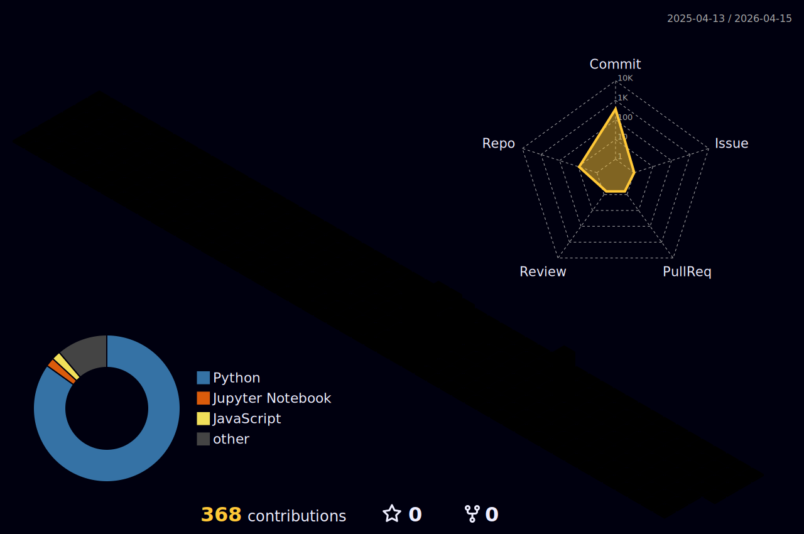

  

<table>
<tr>
<td align="center" width="50%">
<h3>📊 Core Competencies</h3>

</td>
<td width="50%" valign="middle">
<h3>🚀 About Me</h3>
<ul>
<li>데이터 속에 숨겨진 <b>패턴을 발견</b>합니다.</li>
<li><b>대용량 데이터 파이프라인</b> 구축 경험이 있습니다.</li>
<li><b>LLM 및 딥러닝</b> 서비스 개발에 주력합니다.</li>
</ul>
 

</td>
</tr>
</table>

 

<h3>🎯 Focus Areas</h3>

  

<h3>🛠️ Data & AI Tech Stack</h3>

<table>
<tr>
<th align="center">Data Engineering</th>
<th align="center">AI & Machine Learning</th>
<th align="center">Core & Backend</th>
</tr>
<tr>
<td align="center">

 

 

 

</td>
<td align="center">

 

 

 

</td>
<td align="center">

 

 

 

</td>
</tr>
</table>

 

<h3>🌱 Contribution Activity</h3>

